# Client Installation & Onboarding Guide

Complete guide for adding a new business client to the AI Raian Visual — from first admin login through embed, testing, and go-live.

**Audience:** Internal operators (you or your team), not end clients.

**Related docs:**

- [NEW_CLIENT_SETUP.md](NEW_CLIENT_SETUP.md) — quick reference
- [EMBEDDING.md](EMBEDDING.md) — widget embed details
- [LEAD_ENGINE.md](LEAD_ENGINE.md) — scoring & lead API
- [OFFER_GENERATOR.md](OFFER_GENERATOR.md) — packages & offers
- [ASSISTANT.md](ASSISTANT.md) — chat widget
- [CONTENT_FOLLOWUP.md](CONTENT_FOLLOWUP.md) — content & follow-ups
- [DEPLOYMENT.md](DEPLOYMENT.md) — production setup

**Demo reference:** Raian Visual (`slug: raian-visual`) — migrations 003, 005, 007, 009 contain full example data.

---

## Table of contents

1. [Prerequisites](#prerequisites)
2. [Data the client must provide](#data-the-client-must-provide-before-onboarding)
3. [Onboarding workflow overview](#onboarding-workflow-overview)
4. [Step 1 — Create a new client in admin](#1-create-a-new-client-in-admin)
5. [Step 2 — Configure business profile](#2-configure-business-profile)
6. [Step 3 — Add services](#3-add-services)
7. [Step 4 — Add packages](#4-add-packages)
8. [Step 5 — Add lead form fields](#5-add-lead-form-fields)
9. [Step 6 — Configure scoring rules](#6-configure-scoring-rules)
10. [Step 7 — Configure offer template](#7-configure-offer-template)
11. [Step 8 — Configure FAQ and AI assistant](#8-configure-faq-and-ai-assistant)
12. [Step 9 — Configure follow-up messages](#9-configure-follow-up-messages)
13. [Step 10 — Embed the lead form](#10-embed-the-lead-form-on-any-website)
14. [Step 11 — Embed the chat widget](#11-embed-the-chat-widget-on-any-website)
15. [Step 12 — Test the full flow](#12-test-the-full-flow)
16. [Step 13 — Troubleshoot common problems](#13-troubleshoot-common-problems)
17. [Industry checklists](#industry-checklists)
18. [Client onboarding questionnaire](#client-onboarding-questionnaire)

---

## Prerequisites

Before onboarding any client, ensure the platform is running:

| Requirement | Notes |
|-------------|-------|
| Supabase migrations | Run `001` through `009` in order (SQL Editor) |
| Environment variables | `NEXT_PUBLIC_APP_URL`, Supabase keys; `OPENAI_API_KEY` optional |
| Admin access | `/admin` — internal tool, no public signup |
| Production URL | Set `NEXT_PUBLIC_APP_URL` to the live domain before embedding on client sites |

**Estimated setup time:** 2–4 hours for a standard client (simple packages + form + assistant). Complex pricing rules or large FAQ sets may take longer.

---

## Data the client must provide before onboarding

Collect this **before** you start configuring. Use the [questionnaire](#client-onboarding-questionnaire) at the end of this doc.

### Required (minimum viable setup)

- [ ] Legal business / brand name
- [ ] Preferred URL slug (e.g. `studio-maria` — lowercase, hyphens, no spaces)
- [ ] Contact email and phone (shown on offers and used for notifications)
- [ ] Website domain (where widgets will be embedded)
- [ ] Brand primary color (hex, e.g. `#7c3aed`)
- [ ] Short company description (1–3 sentences)
- [ ] List of services offered (names + short descriptions)
- [ ] Package names, prices, currency, and what each includes
- [ ] Lead form questions they want (or approve your industry template)
- [ ] FAQ: top 10–20 real questions customers ask + approved answers
- [ ] Offer validity period and standard delivery terms
- [ ] Preferred language/locale (`ro`, `en`, etc.)

### Recommended (better automation)

- [ ] Logo (for future PDF/branding — store externally for now)
- [ ] Optional add-ons / extras with prices
- [ ] Budget ranges they accept (for scoring and package recommendation)
- [ ] Service areas / cities (for location scoring)
- [ ] Tone of voice examples (formal, friendly, premium, etc.)
- [ ] Claims they **must not** make in marketing (compliance / brand safety)
- [ ] Preferred call-to-action phrases
- [ ] Sample follow-up email / WhatsApp tone (or approve templates)
- [ ] Webhook URL if they use n8n/Make for email (optional)
- [ ] Notification email for new hot leads

### Nice to have

- [ ] Existing price list PDF or menu
- [ ] Competitor positioning notes
- [ ] Seasonal promotions (do not hardcode — use FAQ or content settings)
- [ ] Instagram / social handles for content generator context

---

## Onboarding workflow overview

```mermaid
flowchart LR
  A[Collect questionnaire] --> B[Create client]
  B --> C[Business profile]
  C --> D[Services & packages]
  D --> E[Lead fields + scoring]
  E --> F[Offer template]
  F --> G[Assistant + FAQ]
  G --> H[Content + follow-up settings]
  H --> I[Embed widgets]
  I --> J[Test full flow]
  J --> K[Go live]
```



**Unified workflow after go-live:**

Visitor → Lead form / Chat → Scored lead → Admin review → Generate offer → Mark sent → Auto follow-ups (24h / 72h / 7d) → Content engine → (parallel) AI assistant

---

## 1. Create a new client in admin

**Path:** `/admin/clients` → **New Client** (`/admin/clients/new`)

### Fields

| Field | Description |
|-------|-------------|
| **Client Name** | Display name in admin (e.g. `Studio Maria`) |
| **Slug** | URL-safe identifier for embeds and APIs (e.g. `studio-maria`). Auto-generated from name if left empty. **Cannot change easily after embeds are live.** |
| **Domain** | Client website domain (optional, e.g. `studiomaria.ro`) |
| **Business profile** (on create form) | Company name, tagline, description, contact email/phone, website, primary color |

### After creation

You are redirected to `/admin/clients/[id]` — the **client overview** page with:

- Workflow stats (leads, offers, follow-ups, chats)
- Module shortcuts
- Business configuration form
- Embed preview links and quick embed code

### Checklist

- [ ] Slug is unique and matches client branding
- [ ] Client is **Active** (checkbox on overview — inactive clients may block public widgets)
- [ ] Note the **client UUID** and **slug** — you need both for API/SQL work

---

## 2. Configure business profile

**Path:** `/admin/clients/[id]` → **Business Configuration** section

### Fields

| Field | Used for |
|-------|----------|
| Company name | Offers, emails, assistant knowledge |
| Tagline | Branding context |
| Description | Assistant, content generator, offer intros |
| Contact email / phone | Offers, handoff, notifications |
| Website | Assistant context |
| Primary / secondary color | Widget theming (lead form, chat) |
| Active client | Enable/disable tenant |

Click **Save Configuration** after edits.

### Optional: client settings JSON

Advanced settings (scoring, webhooks, locale) live in `clients.settings`. There is no dedicated admin UI for the full JSON — update via Supabase SQL Editor or PATCH `/api/admin/clients/[id]`:

```json
{
  "locale": "ro",
  "timezone": "Europe/Bucharest",
  "industry": "wedding_photo_video",
  "offer_defaults": {
    "validity_days": 14,
    "currency": "EUR",
    "delivery_terms": "Livrabile în 60–90 zile de la eveniment."
  },
  "notifications": {
    "notify_email": "contact@client.com"
  },
  "webhooks": {
    "lead.created": "https://n8n.example.com/webhook/..."
  }
}
```

### Checklist

- [ ] Company name and contacts are correct
- [ ] Description reflects what the assistant may quote
- [ ] Primary color matches client brand
- [ ] `locale` / `timezone` set in settings if not `ro` / `Europe/Bucharest`

---

## 3. Add services

**Why:** Services feed the AI assistant knowledge base, content generator, and can link to packages (`packages.service_id`).

**Current limitation:** There is **no admin UI** for services. Add them in **Supabase SQL Editor** (or via direct DB access).

### SQL template

Replace `CLIENT_UUID` with the client's id from the overview page.

```sql
INSERT INTO services (client_id, name, slug, description, category, base_price, currency, sort_order)
VALUES
  (
    'CLIENT_UUID',
    'Service Name',
    'service-slug',
    'Short description customers understand.',
    'category_key',
    199.00,
    'EUR',
    1
  )
ON CONFLICT (client_id, slug) DO UPDATE SET
  description = EXCLUDED.description,
  base_price = EXCLUDED.base_price,
  is_active = TRUE;
```

### Fields

| Column | Notes |
|--------|-------|
| `name` | Display name |
| `slug` | Unique per client, lowercase-hyphen |
| `description` | Used by assistant — keep factual |
| `category` | Grouping (e.g. `wedding`, `dental`, `auto`) |
| `base_price` | Starting price; assistant will not invent other prices |
| `currency` | `EUR`, `RON`, etc. |
| `is_active` | Default `true` |

### Checklist

- [ ] One row per distinct service line the business sells
- [ ] Descriptions match what FAQ and packages say (no contradictions)
- [ ] Prices are real — AI only uses DB values

---

## 4. Add packages

**Path:** `/admin/clients/[id]/packages`

### Packages (admin UI)

Use **Add Package**:

| Field | Example |
|-------|---------|
| Name | `Essential` |
| Slug | `essential` |
| Price | `1899` |
| Currency | `EUR` |

Packages appear in offer generation and package recommendation.

### Package features, extras, pricing rules

The packages page **lists** extras and pricing rules but **creating** them currently requires the admin API or SQL.

#### Add extra (API)

```http
POST /api/admin/clients/{clientId}/packages
Content-Type: application/json

{
  "type": "extra",
  "name": "Extra hour coverage",
  "slug": "extra-hour",
  "price": 150,
  "currency": "EUR"
}
```

#### Add pricing rule (API)

```http
POST /api/admin/clients/{clientId}/packages
Content-Type: application/json

{
  "type": "pricing_rule",
  "name": "Essential — mid budget photo+video",
  "rule_type": "recommend_package",
  "priority": 100,
  "conditions": [
    { "field": "desired_services", "operator": "contains", "value": "photo+video" },
    { "field": "budget_range", "operator": "budget_between", "value": { "min": 1600, "max": 2000 } }
  ],
  "action": {
    "package_slug": "essential",
    "reason": "Best fit for photo+video at this budget"
  }
}
```

See [OFFER_GENERATOR.md](OFFER_GENERATOR.md) for condition operators.

#### Package features (API)

```http
POST /api/admin/clients/{clientId}/packages
Content-Type: application/json

{
  "type": "feature",
  "package_id": "PACKAGE_UUID",
  "name": "10 hours coverage",
  "description": "Full day photo + video",
  "sort_order": 1
}
```

**Tip:** Copy structure from `supabase/migrations/005_raian_visual_offers_seed.sql` and adapt.

### Checklist

- [ ] All sellable tiers/packages created with correct slugs
- [ ] Features listed per package (via API/SQL if needed)
- [ ] Extras with prices (optional)
- [ ] At least one pricing rule if you want auto-recommendation on generate-offer
- [ ] Slugs match those referenced in scoring / rules (e.g. `desired_services` values)

---

## 5. Add lead form fields

**Path:** `/admin/clients/[id]/lead-fields`

### Built-in behavior

- Fields are stored in `lead_fields` and rendered dynamically on the embed form
- Standard keys like `name`, `email`, `phone` map to lead columns when applicable
- Custom keys go to `lead.form_data` JSON

### Supported field types

`text`, `email`, `phone`, `date`, `select`, `multi_select`, `textarea`, `number`, `budget_range`, `checkbox`

### Adding a field

| Setting | Notes |
|---------|-------|
| **Field key** | Stable API key (e.g. `wedding_date`, `budget_range`) — used in scoring rules |
| **Label** | Shown to visitors |
| **Type** | See list above |
| **Required** | Toggle on list |
| **Options** | For select/multi_select — one option per line |

### Recommended baseline

Almost every client should have:

1. `name` (text, required)
2. `email` (email, required)
3. `phone` (phone, required)
4. 1–3 qualification fields (date, budget, service choice, location)

Reorder by sort order (lower = first). Deactivate fields instead of deleting if historical leads used them.

### Preview

Open `/embed/lead-form/[slug]` from the client overview **Embed Widgets** card.

### Checklist

- [ ] Required contact fields present
- [ ] Field keys match scoring rule `field` names exactly
- [ ] Select options match pricing rule `value` strings where used
- [ ] Form tested on mobile width

---

## 6. Configure scoring rules

**Why:** Every new lead gets a score (0–100+) and category: **hot**, **warm**, or **cold**.

**Storage:** `clients.settings.lead_scoring` — configure via Supabase SQL or PATCH API (no dedicated admin UI yet).

### Example configuration

```sql
UPDATE clients
SET settings = settings || '{
  "lead_scoring": {
    "rules": [
      { "type": "field_in_list", "field": "desired_services", "value": ["photo+video"], "points": 20, "label": "Full package interest" },
      { "type": "budget_range_min", "field": "budget_range", "min": 1600, "points": 15, "label": "Budget fit" },
      { "type": "field_in_list", "field": "city", "value": ["Iași", "Bucharest"], "points": 15, "label": "Service area" },
      { "type": "required_fields_complete", "points": 15, "label": "Required fields complete" },
      { "type": "completeness", "points": 15, "label": "Form completeness" },
      { "type": "date_within_months", "field": "event_date", "months": 12, "points": 10, "label": "Near-term event" }
    ],
    "thresholds": { "hot": 70, "warm": 40 },
    "recommended_actions": {
      "hot": "Contact within 2 hours",
      "warm": "Follow up within 24 hours",
      "cold": "Add to nurture sequence"
    }
  }
}'::jsonb
WHERE slug = 'CLIENT_SLUG';
```

### Rule types

| Type | Purpose |
|------|---------|
| `field_equals` | Exact match |
| `field_contains` | Substring match |
| `field_in_list` | Value in array (services, cities) |
| `budget_range_min` | Parsed minimum from `budget_range` field |
| `date_within_months` | Event date within N months |
| `date_after_today` | Future date |
| `completeness` | Partial points by % fields filled |
| `required_fields_complete` | All required fields filled |

If `lead_scoring` is missing, **default rules** apply (completeness + required fields).

### Verify

1. Submit a test lead via embed
2. Open `/admin/leads/[leadId]`
3. Check score, category, and breakdown explanation

### Checklist

- [ ] Rules reference existing `field_key` values
- [ ] Thresholds match client's sales process (hot = immediate action)
- [ ] `recommended_actions` written in operator language
- [ ] Test lead scores as expected for hot / warm / cold scenarios

---

## 7. Configure offer template

**Path:** `/admin/clients/[id]/offer-template`

### Email template

Edit **Subject** and **Email Body**. Available variables:

| Variable | Description |
|----------|-------------|
| `{{lead_name}}` | Lead name |
| `{{company_name}}` | From business profile |
| `{{package_name}}` | Selected package |
| `{{package_price}}` | Package price |
| `{{currency}}` | Currency code |
| `{{next_steps}}` | Generated next steps |
| `{{valid_until}}` | Offer validity date |

Also set offer defaults in `clients.settings.offer_defaults` (validity days, delivery terms, currency).

### Generating offers

From a lead: `/admin/leads/[leadId]` → **Generate Offer** (`/admin/leads/[leadId]/generate-offer`)

- Auto-recommends package if pricing rules match
- Optional AI copy (`use_ai_copy`) — wording only, never prices
- Preview HTML, download PDF, mark as sent

### Checklist

- [ ] Template reads naturally in client's language
- [ ] `offer_defaults.validity_days` set
- [ ] Test PDF generated and checked
- [ ] Prices on offer match package DB values

---

## 8. Configure FAQ and AI assistant

### Assistant settings

**Path:** `/admin/clients/[id]/assistant`

| Setting | Purpose |
|---------|---------|
| Assistant enabled | Toggle widget availability |
| Greeting message | First message in chat |
| Fallback message | When answer is not in knowledge base |
| Handoff message | When human takeover detected |
| Lead capture prompt | Nudge to leave contact details |
| Tone | e.g. `professional`, `friendly`, `premium` |
| Lead form URL | Usually `/embed/lead-form/[slug]` |
| Extra system instructions | Business-specific guardrails |

**Knowledge sources (automatic):** business profile, services, packages, FAQ, offer rules. Assistant must **not** invent prices or regulated advice.

### FAQ

**Path:** `/admin/clients/[id]/faq`

Add question / answer / optional category. Prioritize:

- Pricing approach (ranges OK if in DB; no fake discounts)
- Process and timeline
- Service area
- Booking / availability
- Cancellation policy
- What's included in each package

### Preview

- Iframe: `/embed/chat/[slug]`
- Script widget: see [Step 11](#11-embed-the-chat-widget-on-any-website)

### Conversations

**Path:** `/admin/clients/[id]/chat-conversations` — review transcripts and chat-created leads.

### Checklist

- [ ] Assistant enabled
- [ ] Greeting and fallback in client's voice
- [ ] Minimum 10 FAQ entries covering real objections
- [ ] FAQ answers consistent with packages and services
- [ ] Test: ask price → gets DB price or fallback, not invented number
- [ ] Test: lead capture from chat works

---

## 9. Configure follow-up messages

Follow-ups are **scheduled automatically** when an offer is **marked as sent** (24h email, 72h email, 7-day WhatsApp). MVP requires **manual approval** before sending.

### Content settings (tone for AI-generated messages)

**Path:** `/admin/clients/[id]/content-settings`

| Field | Purpose |
|-------|---------|
| Industry | Select from platform list |
| Tone of voice | e.g. `premium, warm, confident` |
| Target audience | Who you're writing to |
| Brand positioning | One-line positioning |
| Preferred CTA | Default closing action |
| Forbidden claims | One per line — AI must avoid |
| Default locale | `ro`, `en`, etc. |

### Content templates (optional, SQL)

Reusable templates live in `content_templates`. Seed examples in `009_raian_visual_content_seed.sql` (`followup_offer_24h`, `whatsapp_reminder`, etc.). No admin UI yet — add via SQL if you want fixed templates before AI generation.

### Managing follow-ups

| Path | Purpose |
|------|---------|
| `/admin/follow-ups` | All pending follow-ups platform-wide |
| `/admin/leads/[leadId]/followups` | Lead-specific sequences |
| `/admin/offers/[offerId]/followups` | Offer-specific sequences |

On follow-up pages, use **FollowupManager**:

1. **Create sequence** — default 24h + 72h + 7-day, or custom delay
2. **Generate AI text** — drafts message using content settings
3. **Approve** — ready to send
4. **Mark sent** — record as sent (MVP: manual send outside platform)

### Checklist

- [ ] Content settings filled for client industry
- [ ] Forbidden claims include anything legally sensitive for their sector
- [ ] Test: mark offer sent → pending follow-ups appear
- [ ] Generate + approve one test message
- [ ] Client understands messages are not auto-sent in MVP

---

## 10. Embed the lead form on any website

Replace `your-domain.com` and `CLIENT_SLUG`.

### Option A — Script embed (recommended)

Floating or inline injection:

```html
<script
  src="https://your-domain.com/widget/lead-form.js"
  data-client="CLIENT_SLUG"
  async
></script>
```

Query param variant:

```html
<script
  src="https://your-domain.com/widget/lead-form.js?client=CLIENT_SLUG"
  async
></script>
```

### Option B — Iframe

```html
<iframe
  src="https://your-domain.com/embed/lead-form/CLIENT_SLUG"
  width="100%"
  height="700"
  frameborder="0"
  style="border:0;border-radius:12px;"
  title="Contact form"
></iframe>
```

### Legacy path

`/embed/CLIENT_SLUG/lead-form` — still supported.

### WordPress / Webflow / Squarespace

Add the script in a **Custom HTML** block or footer injection. Ensure `async` is present. Do not wrap in additional iframes unless using Option B.

### Checklist

- [ ] `NEXT_PUBLIC_APP_URL` points to production domain
- [ ] Client `is_active = true`
- [ ] Lead fields configured
- [ ] Test submission from client's domain (or staging)
- [ ] Lead appears in `/admin/leads`

---

## 11. Embed the chat widget on any website

### Option A — Script embed (floating bubble)

```html
<script
  src="https://your-domain.com/widget/chat.js"
  data-client="CLIENT_SLUG"
  async
></script>
```

### Option B — Iframe (fixed position on page)

```html
<iframe
  src="https://your-domain.com/embed/chat/CLIENT_SLUG"
  width="400"
  height="560"
  frameborder="0"
  style="border:0;border-radius:16px;"
  title="Chat assistant"
></iframe>
```

### Legacy path

`/embed/CLIENT_SLUG/chat`

### Quick copy from admin

Client overview → **Quick Embed Code** block has both widgets pre-filled.

### Checklist

- [ ] Assistant enabled and FAQ populated
- [ ] CORS allows external site (configured in `middleware.ts` for widget paths)
- [ ] Chat loads without console errors
- [ ] Test message send and reply
- [ ] Optional: test lead creation from chat

---

## 12. Test the full flow

Use this end-to-end checklist before handoff to the client.

### Phase A — Lead capture

- [ ] Open embed lead form in incognito
- [ ] Submit with realistic data (hot lead scenario)
- [ ] Confirm lead in `/admin/leads` with correct score category
- [ ] Check score breakdown on lead detail page
- [ ] Submit cold lead scenario — confirm lower score

### Phase B — Offer

- [ ] Open lead → **Generate Offer**
- [ ] Verify recommended package (if rules configured)
- [ ] Add extras if applicable
- [ ] Preview HTML and PDF
- [ ] Confirm totals match package + extras math
- [ ] **Mark as sent**

### Phase C — Follow-ups

- [ ] Open `/admin/follow-ups` or offer follow-ups page
- [ ] Confirm 24h / 72h / 7d scheduled items created
- [ ] Generate AI text for one item
- [ ] Approve and mark sent (workflow test)

### Phase D — Content

- [ ] `/admin/content-generator?client=[id]`
- [ ] Generate one content type (e.g. Instagram caption)
- [ ] Save draft → appears in `/admin/generated-content`
- [ ] If OpenAI unavailable, confirm fallback draft still saves (amber notice)

### Phase E — Assistant

- [ ] Open chat embed
- [ ] Ask FAQ question → correct answer
- [ ] Ask unknown question → fallback message
- [ ] Complete lead capture flow
- [ ] Verify conversation in `/admin/clients/[id]/chat-conversations`

### Phase F — Embed on client site

- [ ] Widgets on production client domain
- [ ] Mobile check
- [ ] One real internal test submission (then delete or mark as test)

**Sign-off:** Client overview stats show leads; operator knows admin URLs for daily use.

---

## 13. Troubleshoot common problems

### Lead form / chat does not load (blank or 500)

| Cause | Fix |
|-------|-----|
| Wrong slug | Verify slug on `/admin/clients/[id]` matches embed `data-client` |
| Client inactive | Enable **Active client** on overview |
| Stale Next.js build | Stop dev server, delete `.next`, restart `npm run dev` |
| Two dev servers | Only one process on port 3000; kill duplicate Node processes |
| Wrong `NEXT_PUBLIC_APP_URL` | Must match URL used in embed scripts; redeploy after change |

### Form submits but lead does not appear

| Cause | Fix |
|-------|-----|
| Validation error | Check browser Network tab for POST `/api/leads` response |
| Wrong client slug | Payload must resolve to active client |
| Supabase connection | Verify env vars and migrations applied |

### Chat "Trimite" / send returns 400

| Cause | Fix |
|-------|-----|
| Invalid `conversation_id` | Usually fixed in current codebase — ensure latest deploy |
| Empty message | Client-side validation |

### Score always cold / zero breakdown

| Cause | Fix |
|-------|-----|
| No `lead_scoring` in settings | Add rules via SQL or rely on defaults |
| Field key mismatch | Rule `field` must match `lead_fields.field_key` |
| Budget rule not matching | Check `budget_range` format and `min` threshold |

### Offer generation fails or wrong package

| Cause | Fix |
|-------|-----|
| No packages | Add at least one active package |
| Pricing rules don't match lead data | Check conditions vs form field values |
| Missing features | Optional — offer still generates |

### PDF or preview empty

| Cause | Fix |
|-------|-----|
| Missing business profile | Fill company name on client overview |
| Offer not generated | Regenerate from lead page |

### Follow-ups not created after marking offer sent

| Cause | Fix |
|-------|-----|
| Offer has no `lead_id` | Lead must be linked |
| Sequence already exists | Check offer follow-ups page — duplicates skipped |
| Migration 008 not applied | Run content/follow-up migration |

### Content generator 400 or 429

| Cause | Fix |
|-------|-----|
| Invalid `lead_id` / `offer_id` in URL | Use valid UUIDs or omit query params |
| OpenAI quota exceeded | Fallback content should still save; add API credits or disable AI reliance |
| Missing content settings | Configure `/admin/clients/[id]/content-settings` |

### Widget blocked on external site

| Cause | Fix |
|-------|-----|
| CSP on client site | Allow script src `your-domain.com` and frame-src for iframes |
| Ad blockers | Test in clean browser profile |
| Mixed content | Embed must use HTTPS in production |

### CORS errors in browser console

Widget paths and public APIs include CORS headers via `middleware.ts`. If errors persist, confirm request URL matches production domain and path (`/widget/*`, `/embed/*`, `/api/leads`, etc.).

---

## Industry checklists

Use after completing generic steps 1–11. Industry values match `content_settings.industry` options in admin.

---

### Wedding photo-video (`wedding_photo_video`)

**Reference demo:** Raian Visual migrations 003, 005, 007, 009.

#### Data & configuration

- [ ] Services: photography, videography, combined packages
- [ ] Packages: tiered (Basic → Premium) with hours, deliverables, team size
- [ ] Lead fields: `wedding_date`, `city`, `venue`, `desired_services`, `budget_range`, `guest_count` (optional)
- [ ] Scoring: photo+video intent, budget min, local area, date within 12–18 months
- [ ] Pricing rules: map budget + service combo → package slug
- [ ] FAQ: delivery timeline, travel fees, second shooter, raw files, payment schedule
- [ ] Assistant tone: premium, warm, emotional
- [ ] Forbidden claims: "cheapest", "viral guarantee", fake scarcity
- [ ] Follow-up templates mention date availability

#### Embed & test

- [ ] Form on `/contact` or booking page
- [ ] Chat on portfolio pages
- [ ] Test hot lead: full package + near date + local + high budget

---

### Beauty salon (`salon`)

#### Data & configuration

- [ ] Services: haircut, color, styling, nails, treatments (with base prices)
- [ ] Packages: bridal, monthly membership, combo treatments
- [ ] Lead fields: `service_interest`, `preferred_date`, `preferred_time`, `first_visit` (checkbox), `phone`
- [ ] Scoring: specific high-value service, appointment within 30 days, phone provided
- [ ] FAQ: cancellation, patch test, parking, price list approach, stylist choice
- [ ] Assistant: friendly, appointment-focused; no medical claims for treatments
- [ ] Offer template: short validity (7–14 days), mention booking link
- [ ] Follow-ups: 24h reminder to book slot

#### Embed & test

- [ ] Form on services page
- [ ] Chat for "how much is balayage?" → FAQ or service price from DB

---

### Dental clinic (`clinic`)

#### Data & configuration

- [ ] Services: consult, hygiene, implants, ortho, cosmetic (factual descriptions only)
- [ ] Packages: new patient exam, whitening bundle, implant consultation
- [ ] Lead fields: `reason_for_visit`, `preferred_date`, `insurance` (optional), `pain_urgency`
- [ ] Scoring: urgency keywords, complete contact, near-term date
- [ ] FAQ: hours, emergency policy, payment plans, what first visit includes
- [ ] Assistant: **no diagnosis**; handoff to human for medical questions
- [ ] Forbidden claims: guaranteed outcomes, "painless" absolutes, before/after promises
- [ ] Content settings: compliance-focused forbidden list

#### Embed & test

- [ ] Form on "Book appointment" page
- [ ] Test handoff when user describes symptoms

---

### Auto service (`auto_service`)

#### Data & configuration

- [ ] Services: ITP, revisions, diagnostics, repairs, tires, detailing
- [ ] Packages: seasonal check, fleet service, premium detail
- [ ] Lead fields: `car_make_model`, `car_year`, `service_type`, `preferred_date`, `mileage`
- [ ] Scoring: specific service selected, VIN/plate optional, appointment within 2 weeks
- [ ] Pricing rules: service type → standard package
- [ ] FAQ: warranty on parts, loaner car, duration, brands serviced
- [ ] Offer template: parts + labor disclaimer, appointment confirmation CTA

#### Embed & test

- [ ] Form on service menu pages
- [ ] Chat answers "how long does ITP take?" from FAQ

---

### Real estate agency (`real_estate`)

#### Data & configuration

- [ ] Services: buy, sell, rent, property management, valuation
- [ ] Packages: exclusive listing, buyer representation tiers (if applicable)
- [ ] Lead fields: `intent` (buy/sell/rent), `budget_range`, `area`, `property_type`, `timeline`
- [ ] Scoring: budget min, timeline within 6 months, specific area match
- [ ] FAQ: commission, exclusivity, viewing process, financing partners (factual)
- [ ] Assistant: no invented listings; direct to agent handoff
- [ ] Forbidden claims: guaranteed sale price, instant sale promises

#### Embed & test

- [ ] Form on property search and contact pages
- [ ] High-intent lead scores hot with budget + timeline

---

### Local service company (`local_service`)

Examples: cleaning, HVAC, plumbing, landscaping, pest control.

#### Data & configuration

- [ ] Services: list each job type with starting price or "from" price
- [ ] Packages: one-off, subscription, emergency call-out
- [ ] Lead fields: `address_or_area`, `service_needed`, `urgency`, `property_size`, `preferred_date`
- [ ] Scoring: service area match, urgency, complete address/area
- [ ] Pricing rules: service + property size → package
- [ ] FAQ: service area, emergency fees, guarantees, what's included
- [ ] Assistant tone: trustworthy, local, practical
- [ ] Follow-ups: 24h "still need help?" for warm leads

#### Embed & test

- [ ] Form on homepage and service pages
- [ ] Out-of-area lead scores lower on location rules

---

## Client onboarding questionnaire

Copy this section into Google Docs, Notion, or a form tool. Send **before** configuration begins.

---

### Section A — Business identity

1. **Legal / brand name:**
2. **Preferred slug** (lowercase, hyphens, e.g. `my-business`):  
   _If unsure, we will propose one._
3. **Website URL:**
4. **Primary contact email** (for leads and offers):
5. **Primary phone:**
6. **Physical address / service areas:**
7. **Primary brand color** (hex code or attach brand guide):
8. **Languages** you serve customers in: ☐ Romanian ☐ English ☐ Other: _______

---

### Section B — Business description

9. **One-line tagline:**
10. **Company description** (3–5 sentences — what you do, who you help, what makes you different):
11. **Industry** (pick one):  
    ☐ Wedding photo/video ☐ Beauty salon ☐ Dental / medical clinic ☐ Auto service ☐ Real estate ☐ Local home/service business ☐ Other: _______
12. **Tone of voice** (pick up to 3):  
    ☐ Professional ☐ Friendly ☐ Premium ☐ Casual ☐ Technical ☐ Warm ☐ Authoritative
13. **Words or claims we must NEVER use** in automated messages:  
    _e.g. "cheapest", "guaranteed results", specific medical promises_

---

### Section C — Services & pricing

14. **List every service you sell** (name + short description + starting price if applicable):

    | Service name | Description | From price | Currency |
    |--------------|-------------|------------|----------|
    | | | | |
    | | | | |

15. **Do you sell fixed packages?** ☐ Yes ☐ No  
    If yes, list each package (name, price, what's included):

    | Package name | Price | Includes |
    |--------------|-------|----------|
    | | | |
    | | | |

16. **Optional add-ons / extras** (name + price):

17. **Default currency:** ☐ EUR ☐ RON ☐ Other: _______
18. **Typical offer validity** (days): _______
19. **Standard delivery / fulfillment terms** (e.g. "Gallery delivered in 60 days"):

---

### Section D — Lead form & qualification

20. **What information do you need from a new inquiry?** (check all that apply):  
    ☐ Name ☐ Email ☐ Phone ☐ Event date ☐ Preferred appointment date ☐ Budget range ☐ Service type ☐ Location / city ☐ Property details ☐ Message / notes ☐ Other: _______

21. **Which fields are mandatory?**
22. **Budget ranges** you use (if any):  
    _e.g. "Under 1000 EUR", "1000–2000 EUR", "2000+ EUR"_
23. **What makes a lead "urgent" or "high priority" for you?**  
    _e.g. event within 6 months, high budget, local, specific service_
24. **What makes a lead low priority?**  
    _e.g. out of area, far-future date, incomplete form_

---

### Section E — FAQ & assistant

25. **Top 10 questions customers ask** (with your approved answers):

    | Question | Approved answer |
    |----------|-----------------|
    | 1. | |
    | 2. | |
    | … | |

26. **Should the chat assistant collect leads automatically?** ☐ Yes ☐ No
27. **Greeting message** you want in chat (or we draft one):
28. **When should the bot hand off to a human?**  
    _e.g. complaints, medical symptoms, custom quotes_
29. **Topics the bot must NOT answer** (legal, medical, pricing not in list, etc.):

---

### Section F — Offers & follow-up

30. **Email subject line style** for offers (or example you like):
31. **Standard next steps** after sending an offer:  
    _e.g. "Reply to confirm" / "Book a call" / "Pay deposit"_
32. **Follow-up preference after an offer is sent:**  
    ☐ 24h reminder ☐ 3-day reminder ☐ 7-day reminder ☐ WhatsApp ☐ Email only
33. **Sample follow-up message** you approve (optional):
34. **Who receives internal notifications for new hot leads?** (email):

---

### Section G — Website & embed

35. **Where should the contact form appear?** (URLs or page names):
36. **Where should the chat widget appear?** ☐ All pages ☐ Contact only ☐ Specific pages: _______
37. **Who will add the embed code?** ☐ Your web agency ☐ Our team ☐ Self (we provide snippet)
38. **Staging site URL** for testing (if any):

---

### Section H — Integrations (optional)

39. **Do you use n8n, Make, Zapier, or custom webhooks?** ☐ Yes ☐ No  
    Webhook URL for new leads: _______
40. **Email provider** for transactional mail (if separate from website):

---

### Section I — Sign-off

41. **Primary approver** for FAQ text, offer template, and automated messages:  
    Name: _______ Email: _______
42. **Target go-live date:** _______
43. **Anything else** we should know about your sales process:

---

**Internal use after questionnaire received**

| Step | Owner | Done |
|------|-------|------|
| Create client in admin | | ☐ |
| Business profile | | ☐ |
| Services (SQL) | | ☐ |
| Packages + rules | | ☐ |
| Lead fields + scoring | | ☐ |
| Offer template | | ☐ |
| Assistant + FAQ | | ☐ |
| Content settings | | ☐ |
| Embed on site | | ☐ |
| Full flow test | | ☐ |
| Client handoff / training | | ☐ |

---

## Quick reference — admin URLs

| Task | URL |
|------|-----|
| All clients | `/admin/clients` |
| Client overview | `/admin/clients/[id]` |
| Lead fields | `/admin/clients/[id]/lead-fields` |
| Packages | `/admin/clients/[id]/packages` |
| Offer template | `/admin/clients/[id]/offer-template` |
| Assistant | `/admin/clients/[id]/assistant` |
| FAQ | `/admin/clients/[id]/faq` |
| Content settings | `/admin/clients/[id]/content-settings` |
| Leads (client) | `/admin/clients/[id]/leads` |
| All leads | `/admin/leads` |
| Content generator | `/admin/content-generator?client=[id]` |
| Follow-ups | `/admin/follow-ups?client=[id]` |
| Lead form preview | `/embed/lead-form/[slug]` |
| Chat preview | `/embed/chat/[slug]` |

---

*Last updated for platform migrations 001–009. When new admin UI is added (e.g. services manager, scoring editor), prefer UI over SQL steps documented here.*
